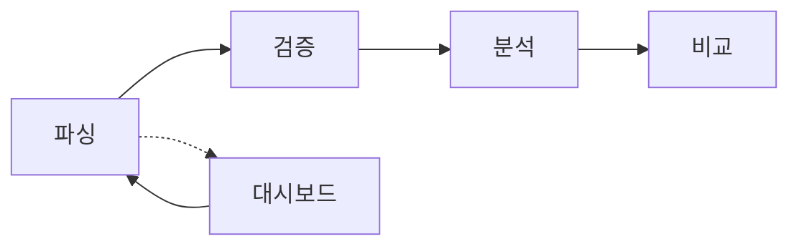
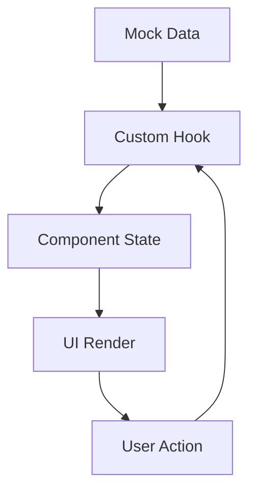

# 🏗️ 견적서 분석 시스템 - 개발자 가이드

## 📋 프로젝트 개요

**현대모비스 견적서 분석 시스템**은 제조업체의 Excel 견적서를 자동으로 분석하여 원가를 검증하고 비교하는 React 기반 웹 애플리케이션입니다.

- **기술 스택**: React 18 + TypeScript + MUI 5 + React Router
- **배포**: GitHub Pages (https://navynam.github.io/AI_COST_ANALYSIS)
- **아키텍처**: Feature-Based 모듈러 구조

## 🎯 핵심 워크플로우



1. **파싱**: Excel 파일 업로드 → AI 데이터 추출
2. **검증**: 매핑 정확도 확인 → 수동 보정
3. **분석**: 원가 구조 분석 → 이상치 감지
4. **비교**: 업체별/제품별 견적 비교

## 📁 프로젝트 구조

```
src/
├── features/                 # 기능별 모듈
│   ├── dashboard/            # 📊 대시보드
│   ├── parsing/              # 🔄 파싱 (파일 업로드)
│   ├── verification/         # ✅ 검증 (데이터 리뷰)
│   ├── analysis/             # 📈 분석 (원가 분석)
│   ├── comparison/           # 📋 비교 (견적 비교)
│   ├── model-management/     # ⚙️ 모델 관리
│   ├── insight/              # 💡 AI 인사이트
│   ├── history/              # 📜 이력 관리
│   ├── settings/             # 🔧 시스템 설정
│   └── auth/                 # 🔐 인증
├── shared/                   # 공통 컴포넌트
│   ├── components/           # 재사용 컴포넌트
│   ├── layouts/              # 레이아웃
│   ├── contexts/             # React Context
│   ├── themes/               # MUI 테마
│   ├── types/                # 공통 타입
│   └── utils/                # 유틸리티
└── types/                    # 글로벌 타입
```

## 🚀 Feature-Based 아키텍처

각 기능(feature)은 독립적인 모듈로 구성:

```
features/[feature-name]/
├── [FeatureName]Page.tsx     # 메인 페이지 컴포넌트
├── components/               # 기능별 전용 컴포넌트
├── hooks/                    # 커스텀 훅
├── data/                     # 목업 데이터
└── types.ts                  # 기능별 타입
```

### 예시: parsing 기능

```
features/parsing/
├── ParsingPage.tsx           # 테이블 뷰 (기존)
├── ParsingCardPage.tsx       # 카드 뷰 (신규)
├── components/
│   ├── FileDetailDrawer.tsx  # 파일 상세 드로어
│   ├── FileTable.tsx         # 파일 목록 테이블
│   ├── FileUploadArea.tsx    # 파일 업로드 영역
│   └── SearchFilterDialog.tsx # 검색/필터
├── hooks/
│   └── useParsingPage.ts     # 파싱 페이지 로직
├── data/
│   └── mockData.ts           # 파싱 목업 데이터
└── types.ts                  # 파싱 관련 타입
```

## 📊 화면별 분석

### 1. 대시보드 (`/dashboard`)

**파일**: `features/dashboard/DashboardPage.tsx`
**핵심 기능**:
- 📈 요약 카드 4개 (총 견적서, 완료율, 이상치, 평균원가)
- 🎯 내가 해야할 작업 6개 상태 (추출중→검증중→검증완료→분석중→분석완료→실패)
- 📊 도넛 차트 (검증 현황)
- 📋 최근 작업 목록 테이블

**데이터 소스**: `dashboard/data/dashboardData.ts`

```typescript
// 작업 목록 데이터 구조
export const workItems = [
  { status: 'extracting', label: '추출중', count: 3, icon: '⚙️', color: '#ff9500' },
  { status: 'verifying', label: '검증중', count: 2, icon: '🔍', color: '#007aff' },
  // ...
];
```

### 2. 파싱 페이지 (`/parsing_card`)

**파일**: `features/parsing/ParsingCardPage.tsx`
**핵심 기능**:
- 📁 파일 업로드 (드래그&드롭)
- 🏷️ 상태별 카드 UI (6개 상태)
- 🔍 검색/필터링
- 📄 파일 상세 드로어

**상태 관리**: 
```typescript
// 파싱 상태 플로우
type ParsingStatus = 'extracting' | 'verifying' | 'verified' | 'analyzing' | 'analyzed' | 'failed';

// 상태별 색상 매핑
const PARSING_STATUS_MAP = {
  extracting: { label: '추출중', color: '#ff9500', icon: '⚙️' },
  verifying: { label: '검증중', color: '#007aff', icon: '🔍' },
  verified: { label: '검증완료', color: '#34c759', icon: '✅' },
  // ...
};
```

### 3. 검증 페이지 (`/verification`)

**파일**: `features/verification/ParsedDataReviewPage.tsx`
**핵심 기능**:
- 📊 좌우 분할 UI (원본 Excel vs 추출 데이터)
- 🎯 셀별 매핑 정확도 시각화
- ✏️ 수동 보정 기능
- 📋 검증 완료 버튼

**데이터 구조**:
```typescript
interface ParsedCell {
  row: number;
  col: number;
  value: string;
  confidence: number;  // 0-1 범위
  category: string;    // '재료비', '가공비', '경비'
  isValid: boolean;
}
```

### 4. 분석 페이지 (`/analysis`)

**파일**: `features/analysis/AnalysisPage.tsx`
**핵심 기능**:
- 📊 표준 뷰: 원가 구조 분석
- 📋 리스트 뷰: 항목별 상세 목록
- 🔗 관계도 뷰: 원가 관계 시각화
- ⭐ 골든셋 뷰: 기준 데이터 관리

**새로운 골든셋 탭**: `analysis/components/GoldenSetView.tsx`

### 5. 비교 페이지 (`/comparison`)

**파일**: `features/comparison/QuotationComparisonPage.tsx`
**핵심 기능**:
- 📊 업체별 견적 비교
- 📈 원가 구조 시각화
- 🎯 이상치 하이라이트

## 🎨 UI 컴포넌트 시스템

### 상태 표시 컴포넌트

```typescript
// 상태 칩
<StatusChip status="verified" />

// 신뢰도 바
<ConfidenceBar value={0.94} />

// 진행률 트래커
<ProgressTracker currentStep={2} />
```

### 레이아웃 시스템

```typescript
// 메인 레이아웃
<MainLayout>
  <Sidebar />
  <main>{children}</main>
</MainLayout>

// 테마 시스템
<ThemeProvider>
  {/* 현대모비스 테마 적용 */}
</ThemeProvider>
```

## 📊 데이터 목업 구조

각 기능별로 실제 동작을 시뮬레이션하는 목업 데이터 제공:

### 1. 파싱 데이터 (`parsing/data/mockData.ts`)

```typescript
export const mockFiles = [
  {
    id: 'file-001',
    name: 'HEAD_LINING_견적서.xlsx',
    company: '대한(주)',
    uploadDate: '2026-02-21',
    status: 'verified' as ParsingStatus,
    parsedItems: 24,
    anomalies: 2,
    confidence: 0.94,
    fileSize: 2.4,
    worksheets: ['원가계산서', '재료비', '가공비']
  }
  // ...
];
```

### 2. 대시보드 데이터 (`dashboard/data/dashboardData.ts`)

```typescript
export const summaryCards = [
  { label: '총 견적서', value: '47건', icon: '📄', color: '#e60012' },
  { label: '검증 완료율', value: '80.9%', icon: '✅', color: '#0056a6' },
  // ...
];

export const recentItems = [
  {
    id: 1,
    filename: 'HEAD_LINING_원가계산서.xlsx',
    company: '대한(주)',
    status: '검증',
    materialCost: 45200,
    processCost: 23100,
    overheadCost: 8500
  }
  // ...
];
```

### 3. 분석 데이터 (`analysis/data/`)

```typescript
// 원가 그룹 구조
export const costGroups = [
  {
    name: '재료비',
    items: ['SM45C', 'STS304', 'AL6061'],
    total: 45200,
    percentage: 58.9
  },
  // ...
];

// Excel 데이터
export const excelData = [
  ['구분', '품명', '규격', '수량', '단가', '금액'],
  ['재료비', 'SM45C', '∅50×100L', 2, 15000, 30000],
  // ...
];
```

## 🔧 개발 환경 설정

### 필수 설치

```bash
# Node.js 18+ 필요
npm install

# 개발 서버 실행
npm start

# 빌드
npm run build

# GitHub Pages 배포
npm run deploy
```

### 주요 의존성

```json
{
  "@mui/material": "^5.15.0",      // UI 컴포넌트
  "@emotion/react": "^11.11.0",    // CSS-in-JS
  "react-router-dom": "^6.8.0",    // 라우팅
  "recharts": "^2.5.0",            // 차트
  "@handsontable/react": "^16.2.0" // Excel 뷰어
}
```

## 🎯 주요 개발 포인트

### 1. 상태 관리

- **로컬 상태**: `useState` + 커스텀 훅
- **글로벌 상태**: React Context (AuthContext, ThemeContext)
- **폼 상태**: 각 기능별 커스텀 훅으로 관리

### 2. 라우팅

- **HashRouter** 사용 (GitHub Pages 호환)
- **중첩 라우팅** 없음 (플랫 구조)
- **Protected Routes** (인증 필요 시)

### 3. 스타일링

- **MUI 테마 시스템** 활용
- **현대모비스 브랜드 컬러** 적용
- **반응형 디자인** (Grid + Breakpoint)

### 4. 데이터 플로우



## 🚀 확장 포인트

### 1. 백엔드 연동

현재 목업 데이터를 실제 API로 교체:

```typescript
// Before (목업)
const { files } = useMockData();

// After (API)
const { files } = useApi('/api/files');
```

### 2. 상태 관리 업그레이드

복잡도 증가 시 Redux Toolkit 도입:

```typescript
// store/slices/parsingSlice.ts
export const parsingSlice = createSlice({
  name: 'parsing',
  initialState: { files: [], status: 'idle' },
  reducers: { ... }
});
```

### 3. 테스트 추가

```typescript
// __tests__/ParsingPage.test.tsx
import { render } from '@testing-library/react';
import ParsingPage from '../ParsingPage';

test('파일 업로드 기능 테스트', () => {
  render(<ParsingPage />);
  // 테스트 로직
});
```

## 🎯 핵심 학습 포인트

### 1. React 18 Patterns
- 함수형 컴포넌트 + 훅
- 커스텀 훅으로 로직 분리
- Context API 활용

### 2. TypeScript 활용
- 인터페이스 정의
- 제네릭 활용
- 타입 가드

### 3. MUI 5 시스템
- 테마 커스터마이징
- sx prop 활용
- 반응형 그리드

### 4. 모듈러 아키텍처
- Feature-based 구조
- 관심사의 분리
- 재사용 가능한 컴포넌트

## 📞 문의

소스 분석 중 질문이나 개선 사항이 있다면 언제든 문의하세요!

---

> 💡 **팁**: 각 feature 폴더부터 분석을 시작하면 전체 구조를 이해하기 쉽습니다.