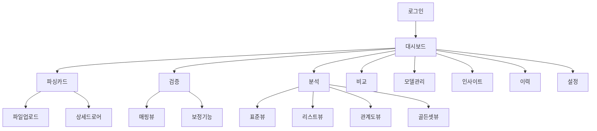

# 🖥️ 화면별 기능 분석 - 견적서 분석 시스템

## 📋 화면 구조 개요



---

## 1. 🔐 로그인 화면 (`/login`)

### 📍 위치
- **파일**: `src/features/auth/LoginPage.tsx`
- **훅**: `src/features/auth/hooks/useLoginPage.ts`

### 🎯 기능
- **사용자 인증**: 아이디/패스워드 입력
- **회사 선택**: 현대모비스, 협력사별 접근 제어
- **자동 로그인**: Remember Me 기능
- **보안 검증**: OTP/2FA (향후 확장)

### 🎨 UI 구성
```jsx
<Container maxWidth="sm">
  <Card elevation={8}>
    <CardContent>
      {/* 현대모비스 로고 */}
      <Box textAlign="center" mb={3}>
        <Avatar sx={{ bgcolor: '#e60012', width: 80, height: 80, mx: 'auto' }}>
          HM
        </Avatar>
        <Typography variant="h4">견적서 분석 시스템</Typography>
      </Box>

      {/* 로그인 폼 */}
      <TextField label="사용자 ID" fullWidth margin="normal" />
      <TextField label="비밀번호" type="password" fullWidth margin="normal" />
      <FormControl fullWidth margin="normal">
        <InputLabel>회사</InputLabel>
        <Select>
          <MenuItem value="hyundai">현대모비스</MenuItem>
          <MenuItem value="supplier">협력사</MenuItem>
        </Select>
      </FormControl>

      {/* 로그인 버튼 */}
      <Button variant="contained" fullWidth size="large">
        로그인
      </Button>
    </CardContent>
  </Card>
</Container>
```

### 📊 상태 관리
```typescript
interface LoginState {
  username: string;
  password: string;
  companyCode: string;
  rememberMe: boolean;
  loading: boolean;
  error: string | null;
}

const useLoginPage = () => {
  const [state, setState] = useState<LoginState>(initialState);
  
  const handleLogin = async (credentials: LoginCredentials) => {
    setState(prev => ({ ...prev, loading: true, error: null }));
    try {
      const response = await authService.login(credentials);
      // 토큰 저장, 리다이렉트
    } catch (error) {
      setState(prev => ({ ...prev, error: error.message }));
    } finally {
      setState(prev => ({ ...prev, loading: false }));
    }
  };
  
  return { ...state, handleLogin };
};
```

---

## 2. 📊 대시보드 화면 (`/dashboard`)

### 📍 위치
- **파일**: `src/features/dashboard/DashboardPage.tsx`
- **데이터**: `src/features/dashboard/data/dashboardData.ts`
- **훅**: `src/features/dashboard/hooks/useDashboardPage.ts`

### 🎯 핵심 기능
- **요약 카드**: 총 견적서, 완료율, 이상치, 평균원가
- **작업 목록**: 6개 상태별 할 일 관리
- **차트**: 검증 현황 도넛 차트
- **최근 목록**: 최근 작업 테이블

### 🎨 레이아웃 구조
```jsx
<Container maxWidth="xl">
  {/* 상단: 기간 필터 */}
  <Box display="flex" justifyContent="space-between" mb={3}>
    <Typography variant="h4">📊 대시보드</Typography>
    <ToggleButtonGroup>
      <ToggleButton value="7d">1주</ToggleButton>
      <ToggleButton value="30d">1개월</ToggleButton>
      <ToggleButton value="90d">3개월</ToggleButton>
    </ToggleButtonGroup>
  </Box>

  {/* 요약 카드 4개 */}
  <Grid container spacing={3} mb={4}>
    {summaryCards.map(card => (
      <Grid item xs={12} sm={6} md={3}>
        <Card>
          <CardContent>
            <Box display="flex" justifyContent="space-between">
              <Box>
                <Typography variant="body2">{card.label}</Typography>
                <Typography variant="h4" fontWeight={700}>
                  {card.value}
                </Typography>
              </Box>
              <Typography fontSize={40}>{card.icon}</Typography>
            </Box>
          </CardContent>
        </Card>
      </Grid>
    ))}
  </Grid>

  {/* 차트 영역 */}
  <Grid container spacing={2}>
    {/* 내가 해야할 작업 (3x2 그리드) */}
    <Grid item xs={12} md={7}>
      <Typography variant="h6">내가 해야할 작업</Typography>
      <Paper sx={{ p: 2 }}>
        <Box sx={{ display: 'grid', gridTemplateColumns: 'repeat(3, 1fr)', gap: 1.5 }}>
          {workItems.map(item => (
            <Card 
              key={item.status}
              onClick={() => navigate('/parsing_card')}
              sx={{ 
                cursor: 'pointer',
                '&:hover': { 
                  transform: 'translateY(-2px)',
                  boxShadow: 4 
                }
              }}
            >
              <CardContent sx={{ textAlign: 'center' }}>
                <Typography fontSize={16}>{item.icon}</Typography>
                <Typography variant="h5" color={item.color}>
                  {item.count}
                </Typography>
                <Typography variant="body2">{item.label}</Typography>
              </CardContent>
            </Card>
          ))}
        </Box>
      </Paper>
    </Grid>

    {/* 최근 검증 현황 차트 */}
    <Grid item xs={12} md={5}>
      <Typography variant="h6">최근 검증 현황</Typography>
      <Paper sx={{ p: 2 }}>
        <ResponsiveContainer width="100%" height={200}>
          <PieChart>
            <Pie
              data={verificationStatus}
              cx="50%" cy="50%"
              innerRadius={60}
              outerRadius={100}
              dataKey="value"
            >
              {verificationStatus.map((entry, index) => (
                <Cell key={index} fill={entry.color} />
              ))}
            </Pie>
            <Tooltip />
          </PieChart>
        </ResponsiveContainer>
      </Paper>
    </Grid>
  </Grid>

  {/* 최근 작업 목록 테이블 */}
  <Box mt={4}>
    <Typography variant="h6" mb={2}>최근 작업 목록</Typography>
    <TableContainer component={Paper}>
      <Table>
        <TableHead>
          <TableRow>
            <TableCell>파일명</TableCell>
            <TableCell>업체명</TableCell>
            <TableCell>상태</TableCell>
            <TableCell align="right">재료비</TableCell>
            <TableCell align="right">가공비</TableCell>
            <TableCell align="right">제경비</TableCell>
            <TableCell align="right">합계</TableCell>
            <TableCell>작업일</TableCell>
          </TableRow>
        </TableHead>
        <TableBody>
          {recentItems.map(item => (
            <TableRow key={item.id} hover>
              <TableCell>{item.filename}</TableCell>
              <TableCell>{item.company}</TableCell>
              <TableCell>
                <Chip 
                  label={item.status} 
                  color={statusColorMap[item.status]} 
                  size="small" 
                />
              </TableCell>
              <TableCell align="right">
                {item.materialCost.toLocaleString()}원
              </TableCell>
              <TableCell align="right">
                {item.processCost.toLocaleString()}원
              </TableCell>
              <TableCell align="right">
                {item.overheadCost.toLocaleString()}원
              </TableCell>
              <TableCell align="right">
                <strong>{item.totalCost.toLocaleString()}원</strong>
              </TableCell>
              <TableCell>{item.date}</TableCell>
            </TableRow>
          ))}
        </TableBody>
      </Table>
    </TableContainer>
  </Box>
</Container>
```

### 📊 데이터 구조
```typescript
// 요약 카드 데이터
export const summaryCards = [
  { label: '총 견적서', value: '47건', icon: '📄', color: '#e60012' },
  { label: '검증 완료율', value: '80.9%', icon: '✅', color: '#0056a6' },
  { label: '이상치 발견', value: '7건', icon: '⚠️', color: '#0070d4' },
  { label: '평균 생산원가', value: '₩76.8천', icon: '💰', color: '#2196f3' }
];

// 작업 목록 (6개 상태)
export const workItems = [
  { status: 'extracting', label: '추출중', count: 3, icon: '⚙️', color: '#ff9500' },
  { status: 'verifying', label: '검증중', count: 2, icon: '🔍', color: '#007aff' },
  { status: 'verified', label: '검증완료', count: 5, icon: '✅', color: '#34c759' },
  { status: 'analyzing', label: '분석중', count: 1, icon: '📊', color: '#af52de' },
  { status: 'analyzed', label: '분석완료', count: 4, icon: '📈', color: '#00c896' },
  { status: 'failed', label: '실패', count: 2, icon: '❌', color: '#ff3b30' }
];

// 검증 현황 차트
export const verificationStatus = [
  { name: '통과', value: 68, color: '#4caf50' },
  { name: '경고', value: 20, color: '#ff9800' },
  { name: '오류', value: 12, color: '#f44336' }
];

// 최근 작업 목록
export const recentItems = [
  {
    id: 1,
    filename: 'HEAD_LINING_원가계산서.xlsx',
    company: '대한(주)',
    status: '검증',
    materialCost: 45200,
    processCost: 23100,
    overheadCost: 8500,
    totalCost: 76800,
    date: '2026-02-21',
    anomalies: 2
  },
  // ... 더 많은 데이터
];
```

---

## 3. 📁 파싱카드 화면 (`/parsing_card`)

### 📍 위치
- **파일**: `src/features/parsing/ParsingCardPage.tsx`
- **컴포넌트**: `src/features/parsing/components/`
  - `FileDetailDrawer.tsx` - 파일 상세 드로어
  - `FileUploadArea.tsx` - 파일 업로드 영역
  - `SearchFilterDialog.tsx` - 검색/필터
- **데이터**: `src/features/parsing/data/mockData.ts`

### 🎯 핵심 기능
- **파일 업로드**: 드래그&드롭, 다중 선택
- **상태별 표시**: 6개 상태 카드 UI
- **검색/필터**: 파일명, 업체, 상태별 필터링
- **상세 정보**: 드로어로 파일 상세 보기

### 🎨 카드 UI 구조
```jsx
<Container maxWidth="xl">
  {/* 상단: 업로드 영역 */}
  <FileUploadArea onUpload={handleFileUpload} />

  {/* 검색/필터 */}
  <Box display="flex" gap={2} mb={3}>
    <TextField 
      placeholder="파일명 또는 업체명 검색"
      InputProps={{
        startAdornment: <SearchIcon />
      }}
      onChange={handleSearch}
    />
    <FormControl>
      <InputLabel>상태 필터</InputLabel>
      <Select value={statusFilter} onChange={handleStatusFilter}>
        <MenuItem value="all">전체</MenuItem>
        <MenuItem value="extracting">추출중</MenuItem>
        <MenuItem value="verifying">검증중</MenuItem>
        <MenuItem value="verified">검증완료</MenuItem>
        <MenuItem value="analyzing">분석중</MenuItem>
        <MenuItem value="analyzed">분석완료</MenuItem>
        <MenuItem value="failed">실패</MenuItem>
      </Select>
    </FormControl>
    <Button 
      variant="outlined" 
      startIcon={<FilterListIcon />}
      onClick={() => setFilterOpen(true)}
    >
      고급 필터
    </Button>
  </Box>

  {/* 파일 카드 그리드 */}
  <Grid container spacing={2}>
    {filteredFiles.map(file => (
      <Grid item xs={12} sm={6} md={4} lg={3} key={file.id}>
        <Card 
          elevation={2}
          onClick={() => openFileDetail(file)}
          sx={{
            cursor: 'pointer',
            transition: 'all 0.2s',
            '&:hover': {
              elevation: 8,
              transform: 'translateY(-2px)'
            }
          }}
        >
          <CardContent>
            {/* 상태 배지 */}
            <Box display="flex" justifyContent="space-between" mb={2}>
              <Chip 
                label={PARSING_STATUS_MAP[file.status].label}
                icon={<span>{PARSING_STATUS_MAP[file.status].icon}</span>}
                color={getStatusColor(file.status)}
                size="small"
              />
              <IconButton size="small">
                <MoreVertIcon />
              </IconButton>
            </Box>

            {/* 파일 정보 */}
            <Typography variant="h6" noWrap title={file.name}>
              {file.name}
            </Typography>
            <Typography variant="body2" color="text.secondary">
              {file.company}
            </Typography>

            {/* 진행률 또는 결과 */}
            {file.status === 'extracting' ? (
              <Box mt={2}>
                <LinearProgress variant="determinate" value={file.progress} />
                <Typography variant="caption">
                  추출 진행률: {file.progress}%
                </Typography>
              </Box>
            ) : file.status !== 'failed' ? (
              <Box display="flex" justifyContent="space-between" mt={2}>
                <Box textAlign="center">
                  <Typography variant="h6" color="primary">
                    {file.parsedItems || 0}
                  </Typography>
                  <Typography variant="caption">파싱 항목</Typography>
                </Box>
                <Box textAlign="center">
                  <Typography variant="h6" color="success.main">
                    {Math.round((file.confidence || 0) * 100)}%
                  </Typography>
                  <Typography variant="caption">신뢰도</Typography>
                </Box>
                <Box textAlign="center">
                  <Typography 
                    variant="h6" 
                    color={file.anomalies > 0 ? "error.main" : "text.secondary"}
                  >
                    {file.anomalies || 0}
                  </Typography>
                  <Typography variant="caption">이상치</Typography>
                </Box>
              </Box>
            ) : (
              <Box mt={2} p={1} bgcolor="error.light" borderRadius={1}>
                <Typography variant="caption" color="error.contrastText">
                  {file.errorMessage || '파싱 실패'}
                </Typography>
              </Box>
            )}

            {/* 액션 버튼 */}
            <Box mt={2}>
              {getActionButton(file.status, file.id)}
            </Box>
          </CardContent>
        </Card>
      </Grid>
    ))}
  </Grid>

  {/* 파일 상세 드로어 */}
  <FileDetailDrawer
    open={drawerOpen}
    file={selectedFile}
    onClose={() => setDrawerOpen(false)}
    onStatusChange={handleStatusChange}
  />
</Container>
```

### 📊 상태별 액션 버튼
```typescript
const getActionButton = (status: ParsingStatus, fileId: string) => {
  switch (status) {
    case 'extracting':
      return (
        <Button disabled fullWidth>
          <CircularProgress size={16} sx={{ mr: 1 }} />
          추출중...
        </Button>
      );
    
    case 'verifying':
      return (
        <Button 
          variant="contained" 
          fullWidth
          onClick={() => navigate(\`/verification?file=\${fileId}\`)}
        >
          검증하기
        </Button>
      );
    
    case 'verified':
      return (
        <Button 
          variant="outlined" 
          fullWidth
          onClick={() => navigate(\`/analysis?file=\${fileId}\`)}
        >
          분석하기
        </Button>
      );
    
    case 'analyzing':
      return (
        <Button disabled fullWidth>
          <CircularProgress size={16} sx={{ mr: 1 }} />
          분석중...
        </Button>
      );
    
    case 'analyzed':
      return (
        <Button 
          variant="contained" 
          color="success"
          fullWidth
          onClick={() => navigate(\`/comparison?files=\${fileId}\`)}
        >
          비교하기
        </Button>
      );
    
    case 'failed':
      return (
        <Button 
          variant="outlined" 
          color="error"
          fullWidth
          onClick={() => retryParsing(fileId)}
        >
          다시 시도
        </Button>
      );
    
    default:
      return null;
  }
};
```

### 🗂️ 파일 상세 드로어
```jsx
<Drawer anchor="right" open={open} onClose={onClose}>
  <Box sx={{ width: 400, p: 3 }}>
    {/* 헤더 */}
    <Box display="flex" justifyContent="space-between" mb={3}>
      <Typography variant="h6">파일 상세 정보</Typography>
      <IconButton onClick={onClose}>
        <CloseIcon />
      </IconButton>
    </Box>

    {/* 파일 기본 정보 */}
    <Card variant="outlined" sx={{ mb: 2 }}>
      <CardContent>
        <Typography variant="subtitle2" color="primary">
          📁 기본 정보
        </Typography>
        <Divider sx={{ my: 1 }} />
        
        <Box mb={1}>
          <Typography variant="caption">파일명</Typography>
          <Typography variant="body2" fontWeight={600}>
            {file?.name}
          </Typography>
        </Box>
        
        <Box mb={1}>
          <Typography variant="caption">업체명</Typography>
          <Typography variant="body2">{file?.company}</Typography>
        </Box>
        
        <Box mb={1}>
          <Typography variant="caption">업로드일</Typography>
          <Typography variant="body2">{file?.uploadDate}</Typography>
        </Box>
        
        <Box mb={1}>
          <Typography variant="caption">파일 크기</Typography>
          <Typography variant="body2">{file?.fileSize} MB</Typography>
        </Box>
      </CardContent>
    </Card>

    {/* 추출 완료 정보 (분리된 섹션) */}
    {['verifying', 'verified', 'analyzing', 'analyzed'].includes(file?.status) && (
      <Card variant="outlined" sx={{ mb: 2, bgcolor: '#f0fdf4' }}>
        <CardContent>
          <Typography variant="subtitle2" color="success.main">
            ✨ 추출 완료
          </Typography>
          <Divider sx={{ my: 1 }} />
          
          {/* 추출 결과 요약 */}
          <Box display="flex" justifyContent="space-between">
            <Box textAlign="center">
              <Typography variant="h6" color="primary">
                {file?.parsedItems || 0}
              </Typography>
              <Typography variant="caption">파싱 항목</Typography>
            </Box>
            <Box textAlign="center">
              <Typography variant="h6" color="success.main">
                {Math.round((file?.confidence || 0) * 100)}%
              </Typography>
              <Typography variant="caption">신뢰도</Typography>
            </Box>
            <Box textAlign="center">
              <Typography variant="h6" color="error.main">
                {file?.anomalies || 0}
              </Typography>
              <Typography variant="caption">이상치</Typography>
            </Box>
          </Box>

          {/* 추출된 카테고리 */}
          <Box mt={2}>
            <Typography variant="caption" fontWeight={600}>
              추출된 카테고리
            </Typography>
            <Box display="flex" gap={1} flexWrap="wrap" mt={1}>
              <Chip label="재료비 (4건)" size="small" color="primary" />
              <Chip label="가공비 (3건)" size="small" color="warning" />
              <Chip label="경비 (2건)" size="small" color="success" />
            </Box>
          </Box>
        </CardContent>
      </Card>
    )}

    {/* 파일 정보 (별도 배경으로 분리) */}
    {['verifying', 'verified', 'analyzing', 'analyzed'].includes(file?.status) && (
      <Card variant="outlined" sx={{ bgcolor: '#f8fafc' }}>
        <CardContent>
          <Typography variant="subtitle2" color="primary">
            📄 파일 정보
          </Typography>
          <Divider sx={{ my: 1 }} />
          
          {/* 상세 파일 정보들 */}
          <Box display="flex" flexDirection="column" gap={1}>
            {/* 파일명 카드 */}
            <Box sx={{ 
              p: 1.5,
              bgcolor: '#fff9e6',
              borderRadius: '8px',
              border: '1px solid #ffd740',
              borderLeft: '4px solid #f57c00'
            }}>
              <Typography variant="caption" color="#f57c00" fontWeight={600}>
                파일명
              </Typography>
              <Typography variant="body2" fontWeight={700}>
                {file?.name || 'DOOR_TRIM.xlsx'}
              </Typography>
            </Box>

            {/* C.O. NO.와 품번 */}
            <Box display="flex" gap={1}>
              <Box sx={{ 
                flex: 1, p: 1.2, bgcolor: '#e3f2fd',
                borderRadius: '6px', border: '1px solid #90caf9'
              }}>
                <Typography variant="caption" color="#1565c0" fontWeight={600}>
                  C.O. NO.
                </Typography>
                <Typography variant="body2" color="#0d47a1" fontWeight={600}>
                  CO-2024-001
                </Typography>
              </Box>
              <Box sx={{ 
                flex: 1, p: 1.2, bgcolor: '#f3e5f5',
                borderRadius: '6px', border: '1px solid #ce93d8'
              }}>
                <Typography variant="caption" color="#7b1fa2" fontWeight={600}>
                  품번
                </Typography>
                <Typography variant="body2" color="#4a148c" fontWeight={600}>
                  HL-2024-001
                </Typography>
              </Box>
            </Box>

            {/* 품명 */}
            <Box sx={{ 
              p: 1.5, bgcolor: '#e8f5e8',
              borderRadius: '8px', border: '1px solid #a5d6a7'
            }}>
              <Typography variant="caption" color="#2e7d32" fontWeight={600}>
                품명
              </Typography>
              <Typography variant="body2" color="#1b5e20" fontWeight={700}>
                헤드라이닝 ASSY
              </Typography>
            </Box>

            {/* 업체명과 담당자 */}
            <Box display="flex" gap={1}>
              <Box sx={{ 
                flex: 1, p: 1.2, bgcolor: '#fff3e0',
                borderRadius: '6px', border: '1px solid #ffcc02'
              }}>
                <Typography variant="caption" color="#e65100" fontWeight={600}>
                  업체명
                </Typography>
                <Typography variant="body2" color="#e65100" fontWeight={600}>
                  대리(주)
                </Typography>
              </Box>
              <Box sx={{ 
                flex: 1, p: 1.2, bgcolor: '#fce4ec',
                borderRadius: '6px', border: '1px solid #f8bbd9'
              }}>
                <Typography variant="caption" color="#c2185b" fontWeight={600}>
                  담당자
                </Typography>
                <Typography variant="body2" color="#880e4f" fontWeight={600}>
                  원장수
                </Typography>
              </Box>
            </Box>
          </Box>
        </CardContent>
      </Card>
    )}

    {/* 액션 버튼 */}
    <Box mt={3}>
      {getActionButton(file?.status, file?.id)}
    </Box>
  </Box>
</Drawer>
```

---

## 4. ✅ 검증 화면 (`/verification`)

### 📍 위치
- **파일**: `src/features/verification/ParsedDataReviewPage.tsx`
- **컴포넌트**: `src/features/verification/components/ReportDialog.tsx`

### 🎯 핵심 기능
- **좌우 분할 UI**: 원본 Excel (좌) vs 추출 데이터 (우)
- **셀별 매핑**: 클릭으로 대응 관계 표시
- **신뢰도 시각화**: 색상으로 정확도 표현
- **수동 보정**: 잘못된 데이터 직접 수정

### 🎨 분할 화면 구조
```jsx
<Container maxWidth="xl">
  {/* 상단 헤더 */}
  <Box display="flex" justifyContent="space-between" mb={3}>
    <Box>
      <Typography variant="h4">📋 데이터 검증</Typography>
      <Typography variant="body2" color="text.secondary">
        {fileName} - 추출된 데이터를 검토하고 필요시 수정하세요
      </Typography>
    </Box>
    <Box display="flex" gap={2}>
      <Button variant="outlined" startIcon={<ReportIcon />}>
        검증 보고서
      </Button>
      <Button 
        variant="contained" 
        color="success"
        onClick={handleVerificationComplete}
        disabled={hasErrors}
      >
        검증 완료
      </Button>
    </Box>
  </Box>

  {/* 좌우 분할 메인 영역 */}
  <Box display="flex" height="calc(100vh - 200px)" gap={2}>
    {/* 좌측: 원본 Excel */}
    <Paper sx={{ flex: 1, overflow: 'hidden' }}>
      <Box sx={{ p: 2, bgcolor: 'grey.50', borderBottom: 1, borderColor: 'divider' }}>
        <Typography variant="h6" color="primary">
          📊 원본 Excel 파일
        </Typography>
        <Typography variant="caption">
          클릭하여 추출된 데이터와 매핑을 확인하세요
        </Typography>
      </Box>
      
      <Box sx={{ height: 'calc(100% - 80px)', overflow: 'auto' }}>
        <ExcelViewer
          data={originalExcelData}
          onCellClick={handleCellClick}
          highlightedCells={selectedMappings}
        />
      </Box>
    </Paper>

    {/* 우측: 추출된 데이터 */}
    <Paper sx={{ flex: 1, overflow: 'hidden' }}>
      <Box sx={{ p: 2, bgcolor: 'success.50', borderBottom: 1, borderColor: 'divider' }}>
        <Typography variant="h6" color="success.main">
          🎯 추출된 데이터
        </Typography>
        <Box display="flex" justifyContent="space-between" mt={1}>
          <Typography variant="caption">
            총 {extractedData.length}개 항목
          </Typography>
          <Box display="flex" gap={2}>
            <Chip label={`높은 신뢰도: ${highConfidence}`} color="success" size="small" />
            <Chip label={`보통 신뢰도: ${mediumConfidence}`} color="warning" size="small" />
            <Chip label={`낮은 신뢰도: ${lowConfidence}`} color="error" size="small" />
          </Box>
        </Box>
      </Box>

      <Box sx={{ height: 'calc(100% - 80px)', overflow: 'auto', p: 2 }}>
        <TableContainer>
          <Table size="small" stickyHeader>
            <TableHead>
              <TableRow>
                <TableCell>카테고리</TableCell>
                <TableCell>항목명</TableCell>
                <TableCell>값</TableCell>
                <TableCell>단위</TableCell>
                <TableCell>신뢰도</TableCell>
                <TableCell>원본위치</TableCell>
                <TableCell>액션</TableCell>
              </TableRow>
            </TableHead>
            <TableBody>
              {extractedData.map((item, index) => (
                <TableRow 
                  key={item.id}
                  hover
                  selected={selectedItem?.id === item.id}
                  onClick={() => setSelectedItem(item)}
                >
                  <TableCell>
                    <Chip 
                      label={item.category}
                      color={getCategoryColor(item.category)}
                      size="small"
                    />
                  </TableCell>
                  <TableCell>{item.itemName}</TableCell>
                  <TableCell>
                    <TextField
                      size="small"
                      value={item.value}
                      onChange={(e) => handleValueChange(item.id, e.target.value)}
                      error={item.hasError}
                      sx={{ width: 120 }}
                    />
                  </TableCell>
                  <TableCell>{item.unit}</TableCell>
                  <TableCell>
                    <ConfidenceBar 
                      value={item.confidence}
                      showLabel
                    />
                  </TableCell>
                  <TableCell>
                    <Button
                      size="small"
                      variant="outlined"
                      onClick={() => highlightSourceCell(item.sourceLocation)}
                    >
                      {item.sourceLocation}
                    </Button>
                  </TableCell>
                  <TableCell>
                    <IconButton
                      size="small"
                      color={item.isValidated ? "success" : "default"}
                      onClick={() => toggleValidation(item.id)}
                    >
                      {item.isValidated ? <CheckCircleIcon /> : <RadioButtonUncheckedIcon />}
                    </IconButton>
                    {item.confidence < 0.7 && (
                      <IconButton size="small" color="warning">
                        <WarningIcon />
                      </IconButton>
                    )}
                  </TableCell>
                </TableRow>
              ))}
            </TableBody>
          </Table>
        </TableContainer>
      </Box>
    </Paper>
  </Box>

  {/* 하단: 검증 통계 */}
  <Paper sx={{ mt: 2, p: 2 }}>
    <Typography variant="h6" mb={2}>검증 진행 현황</Typography>
    <Grid container spacing={3}>
      <Grid item xs={3}>
        <Box textAlign="center">
          <Typography variant="h4" color="primary">
            {extractedData.length}
          </Typography>
          <Typography variant="caption">총 항목</Typography>
        </Box>
      </Grid>
      <Grid item xs={3}>
        <Box textAlign="center">
          <Typography variant="h4" color="success.main">
            {validatedCount}
          </Typography>
          <Typography variant="caption">검증 완료</Typography>
        </Box>
      </Grid>
      <Grid item xs={3}>
        <Box textAlign="center">
          <Typography variant="h4" color="warning.main">
            {pendingCount}
          </Typography>
          <Typography variant="caption">검증 대기</Typography>
        </Box>
      </Grid>
      <Grid item xs={3}>
        <Box textAlign="center">
          <Typography variant="h4" color="error.main">
            {errorCount}
          </Typography>
          <Typography variant="caption">오류</Typography>
        </Box>
      </Grid>
    </Grid>
    
    <Box mt={2}>
      <LinearProgress 
        variant="determinate" 
        value={(validatedCount / extractedData.length) * 100}
        sx={{ height: 8, borderRadius: 4 }}
      />
      <Typography variant="caption" sx={{ mt: 0.5, display: 'block' }}>
        검증 진행률: {Math.round((validatedCount / extractedData.length) * 100)}%
      </Typography>
    </Box>
  </Paper>
</Container>
```

### 📊 신뢰도 시각화 컴포넌트
```tsx
const ConfidenceBar: React.FC<{ value: number; showLabel?: boolean }> = ({ 
  value, 
  showLabel 
}) => {
  const getColor = (confidence: number) => {
    if (confidence >= 0.8) return 'success';
    if (confidence >= 0.6) return 'warning';
    return 'error';
  };

  return (
    <Box display="flex" alignItems="center" gap={1}>
      <LinearProgress
        variant="determinate"
        value={value * 100}
        color={getColor(value)}
        sx={{ 
          width: 60, 
          height: 6, 
          borderRadius: 3,
          backgroundColor: 'grey.200'
        }}
      />
      {showLabel && (
        <Typography variant="caption" fontWeight={600}>
          {Math.round(value * 100)}%
        </Typography>
      )}
    </Box>
  );
};
```

---

## 5. 📈 분석 화면 (`/analysis`)

### 📍 위치
- **파일**: `src/features/analysis/AnalysisPage.tsx`
- **컴포넌트**: `src/features/analysis/components/`
  - `GoldenSetView.tsx` - 골든셋 탭
  - `RelationView.tsx` - 관계도 뷰
  - `ListView.tsx` - 리스트 뷰
  - `ExcelViewerDialog.tsx` - Excel 뷰어

### 🎯 핵심 기능
- **표준 뷰**: 원가 구조 분석 차트
- **리스트 뷰**: 항목별 상세 데이터
- **관계도 뷰**: 원가 항목 간 관계 시각화
- **골든셋 뷰**: 기준 데이터 관리 (신규)

### 🎨 탭 기반 구조
```jsx
<Container maxWidth="xl">
  {/* 상단 헤더 */}
  <Box display="flex" justifyContent="space-between" mb={3}>
    <Box>
      <Typography variant="h4">📊 원가 분석</Typography>
      <Typography variant="body2" color="text.secondary">
        {fileName} - 원가 구조를 분석하고 이상치를 확인하세요
      </Typography>
    </Box>
    <Box display="flex" gap={2}>
      <Button variant="outlined" startIcon={<ShareIcon />}>
        공유
      </Button>
      <Button variant="outlined" startIcon={<DownloadIcon />}>
        보고서 다운로드
      </Button>
      <Button 
        variant="contained"
        onClick={handleAnalysisComplete}
      >
        완료 & 저장
      </Button>
    </Box>
  </Box>

  {/* 탭 네비게이션 */}
  <Box sx={{ borderBottom: 1, borderColor: 'divider', mb: 3 }}>
    <Tabs value={activeTab} onChange={handleTabChange}>
      <Tab 
        label={
          <Box display="flex" alignItems="center" gap={1}>
            <PieChartIcon />
            표준 뷰
          </Box>
        }
        value="standard"
      />
      <Tab 
        label={
          <Box display="flex" alignItems="center" gap={1}>
            <ListIcon />
            리스트 뷰
          </Box>
        }
        value="list"
      />
      <Tab 
        label={
          <Box display="flex" alignItems="center" gap={1}>
            <AccountTreeIcon />
            관계도 뷰
          </Box>
        }
        value="relation"
      />
      <Tab 
        label={
          <Box display="flex" alignItems="center" gap={1}>
            <StarIcon />
            골든셋 뷰
          </Box>
        }
        value="golden"
      />
    </Tabs>
  </Box>

  {/* 탭 컨텐츠 */}
  {activeTab === 'standard' && <StandardView data={analysisData} />}
  {activeTab === 'list' && <ListView data={listData} />}
  {activeTab === 'relation' && <RelationView data={relationData} />}
  {activeTab === 'golden' && <GoldenSetView data={goldenSetData} />}
</Container>
```

### 📊 표준 뷰 (원가 구조 차트)
```jsx
const StandardView: React.FC<{ data: AnalysisData }> = ({ data }) => (
  <Grid container spacing={3}>
    {/* 좌측: 원가 구조 파이 차트 */}
    <Grid item xs={12} md={6}>
      <Paper sx={{ p: 3, height: 400 }}>
        <Typography variant="h6" mb={2}>원가 구조 분석</Typography>
        <ResponsiveContainer width="100%" height={300}>
          <PieChart>
            <Pie
              data={data.costBreakdown}
              cx="50%"
              cy="50%"
              innerRadius={60}
              outerRadius={120}
              paddingAngle={2}
              dataKey="amount"
            >
              {data.costBreakdown.map((entry, index) => (
                <Cell key={index} fill={entry.color} />
              ))}
            </Pie>
            <Tooltip formatter={(value) => `₩${value.toLocaleString()}`} />
            <Legend />
          </PieChart>
        </ResponsiveContainer>
      </Paper>
    </Grid>

    {/* 우측: 원가 상세 */}
    <Grid item xs={12} md={6}>
      <Paper sx={{ p: 3, height: 400 }}>
        <Typography variant="h6" mb={2}>원가 상세</Typography>
        <Box display="flex" flexDirection="column" gap={2}>
          {data.costBreakdown.map((category) => (
            <Box key={category.name}>
              <Box display="flex" justifyContent="space-between" mb={1}>
                <Typography variant="body1" fontWeight={600}>
                  {category.name}
                </Typography>
                <Box textAlign="right">
                  <Typography variant="h6">
                    ₩{category.amount.toLocaleString()}
                  </Typography>
                  <Typography variant="caption" color="text.secondary">
                    {category.percentage.toFixed(1)}%
                  </Typography>
                </Box>
              </Box>
              <LinearProgress
                variant="determinate"
                value={category.percentage}
                sx={{ 
                  height: 8, 
                  borderRadius: 4,
                  backgroundColor: 'grey.200',
                  '& .MuiLinearProgress-bar': {
                    backgroundColor: category.color
                  }
                }}
              />
            </Box>
          ))}
        </Box>

        <Divider sx={{ my: 2 }} />
        
        <Box display="flex" justifyContent="space-between" alignItems="center">
          <Typography variant="h6">총 원가</Typography>
          <Typography variant="h5" color="primary" fontWeight={700}>
            ₩{data.totalCost.toLocaleString()}
          </Typography>
        </Box>
      </Paper>
    </Grid>

    {/* 하단: 이상치 및 인사이트 */}
    <Grid item xs={12}>
      <Paper sx={{ p: 3 }}>
        <Typography variant="h6" mb={2}>AI 인사이트</Typography>
        <Grid container spacing={2}>
          {data.insights.map((insight, index) => (
            <Grid item xs={12} md={4} key={index}>
              <Card 
                variant="outlined"
                sx={{ 
                  p: 2,
                  border: 2,
                  borderColor: insight.severity === 'high' ? 'error.main' :
                               insight.severity === 'medium' ? 'warning.main' :
                               'success.main'
                }}
              >
                <Box display="flex" alignItems="center" gap={1} mb={1}>
                  <Icon color={
                    insight.severity === 'high' ? 'error' :
                    insight.severity === 'medium' ? 'warning' : 'success'
                  }>
                    {insight.icon}
                  </Icon>
                  <Typography variant="subtitle2" fontWeight={600}>
                    {insight.title}
                  </Typography>
                </Box>
                <Typography variant="body2" mb={2}>
                  {insight.description}
                </Typography>
                {insight.recommendation && (
                  <Box sx={{ p: 1, bgcolor: 'grey.50', borderRadius: 1 }}>
                    <Typography variant="caption" color="text.secondary">
                      💡 추천: {insight.recommendation}
                    </Typography>
                  </Box>
                )}
              </Card>
            </Grid>
          ))}
        </Grid>
      </Paper>
    </Grid>
  </Grid>
);
```

### ⭐ 골든셋 뷰 (신규 기능)
```jsx
const GoldenSetView: React.FC<{ data: GoldenSetData }> = ({ data }) => {
  const [selectedStandard, setSelectedStandard] = useState(null);

  return (
    <Grid container spacing={3}>
      {/* 좌측: 기준 데이터 목록 */}
      <Grid item xs={12} md={6}>
        <Paper sx={{ p: 3, height: 500 }}>
          <Typography variant="h6" mb={2}>기준 데이터 (Golden Set)</Typography>
          
          <List>
            {data.standards.map((standard) => (
              <ListItem
                key={standard.id}
                button
                selected={selectedStandard?.id === standard.id}
                onClick={() => setSelectedStandard(standard)}
                sx={{ 
                  border: 1, 
                  borderColor: 'divider', 
                  borderRadius: 1, 
                  mb: 1 
                }}
              >
                <ListItemText
                  primary={standard.name}
                  secondary={
                    <Box>
                      <Typography variant="caption">
                        기준 단가: ₩{standard.standardCost.toLocaleString()} / {standard.unit}
                      </Typography>
                      <br />
                      <Typography variant="caption" color="text.secondary">
                        허용 오차: ±{standard.tolerance}%
                      </Typography>
                    </Box>
                  }
                />
                <ListItemSecondaryAction>
                  <Chip
                    label={standard.status}
                    color={standard.status === 'active' ? 'success' : 'default'}
                    size="small"
                  />
                </ListItemSecondaryAction>
              </ListItem>
            ))}
          </List>

          <Box mt={2}>
            <Button
              variant="outlined"
              fullWidth
              startIcon={<AddIcon />}
              onClick={() => setAddStandardOpen(true)}
            >
              새 기준 추가
            </Button>
          </Box>
        </Paper>
      </Grid>

      {/* 우측: 편차 분석 */}
      <Grid item xs={12} md={6}>
        <Paper sx={{ p: 3, height: 500 }}>
          <Typography variant="h6" mb={2}>편차 분석</Typography>
          
          {selectedStandard ? (
            <Box>
              <Typography variant="subtitle1" mb={2}>
                {selectedStandard.name} 편차 현황
              </Typography>
              
              <TableContainer>
                <Table size="small">
                  <TableHead>
                    <TableRow>
                      <TableCell>항목</TableCell>
                      <TableCell align="right">기준 단가</TableCell>
                      <TableCell align="right">실제 단가</TableCell>
                      <TableCell align="right">편차</TableCell>
                      <TableCell>상태</TableCell>
                    </TableRow>
                  </TableHead>
                  <TableBody>
                    {data.deviations
                      .filter(d => d.standardId === selectedStandard.id)
                      .map((deviation) => (
                        <TableRow key={deviation.id}>
                          <TableCell>{deviation.itemName}</TableCell>
                          <TableCell align="right">
                            ₩{deviation.standardCost.toLocaleString()}
                          </TableCell>
                          <TableCell align="right">
                            ₩{deviation.actualCost.toLocaleString()}
                          </TableCell>
                          <TableCell align="right">
                            <Typography
                              color={
                                deviation.deviationPercent > 0 ? 'error.main' : 'success.main'
                              }
                              fontWeight={600}
                            >
                              {deviation.deviationPercent > 0 ? '+' : ''}
                              {deviation.deviationPercent.toFixed(1)}%
                            </Typography>
                          </TableCell>
                          <TableCell>
                            <Chip
                              label={deviation.severity}
                              color={
                                deviation.severity === 'high' ? 'error' :
                                deviation.severity === 'medium' ? 'warning' :
                                'success'
                              }
                              size="small"
                            />
                          </TableCell>
                        </TableRow>
                      ))}
                  </TableBody>
                </Table>
              </TableContainer>
            </Box>
          ) : (
            <Box 
              display="flex" 
              alignItems="center" 
              justifyContent="center" 
              height="100%"
              color="text.secondary"
            >
              <Typography variant="body2">
                좌측에서 기준 데이터를 선택하세요
              </Typography>
            </Box>
          )}
        </Paper>
      </Grid>

      {/* 하단: 전체 편차 요약 */}
      <Grid item xs={12}>
        <Paper sx={{ p: 3 }}>
          <Typography variant="h6" mb={2}>전체 편차 요약</Typography>
          
          <Grid container spacing={3}>
            <Grid item xs={3}>
              <Box textAlign="center">
                <Typography variant="h4" color="error.main">
                  {data.summary.highDeviations}
                </Typography>
                <Typography variant="caption">심각한 편차</Typography>
              </Box>
            </Grid>
            <Grid item xs={3}>
              <Box textAlign="center">
                <Typography variant="h4" color="warning.main">
                  {data.summary.mediumDeviations}
                </Typography>
                <Typography variant="caption">주의 편차</Typography>
              </Box>
            </Grid>
            <Grid item xs={3}>
              <Box textAlign="center">
                <Typography variant="h4" color="success.main">
                  {data.summary.lowDeviations}
                </Typography>
                <Typography variant="caption">정상 범위</Typography>
              </Box>
            </Grid>
            <Grid item xs={3}>
              <Box textAlign="center">
                <Typography variant="h4" color="primary">
                  {data.summary.complianceRate.toFixed(1)}%
                </Typography>
                <Typography variant="caption">준수율</Typography>
              </Box>
            </Grid>
          </Grid>
        </Paper>
      </Grid>
    </Grid>
  );
};
```

---

## 📊 총 정리

### 🏗️ 아키텍처 특징
1. **Feature-Based 구조**: 기능별 독립 모듈
2. **컴포넌트 재사용**: 공통 UI 컴포넌트 활용
3. **타입 안정성**: TypeScript 전면 도입
4. **반응형 디자인**: MUI Grid 시스템 활용

### 🎯 핵심 워크플로우
1. **업로드** → 파싱카드에서 Excel 업로드
2. **파싱** → AI가 자동으로 데이터 추출
3. **검증** → 좌우 분할 화면에서 정확도 검증
4. **분석** → 4개 뷰로 다각도 원가 분석
5. **비교** → 여러 견적서 비교 분석

### 📱 UI/UX 특징
- **직관적 네비게이션**: 상태별 색상 구분
- **실시간 피드백**: 진행률, 신뢰도 시각화
- **접근성**: 키보드 네비게이션, 고대비 색상
- **반응형**: 모바일부터 대형 모니터까지 최적화

이 가이드로 중급 개발자들이 소스를 효율적으로 분석할 수 있을 거야! 🚀