# 서비스 호출 관계도 (Call Graph)

> ⚙️ **자동 생성 파일** — 직접 수정하지 마세요. 원본은 [`call-graph.yaml`](call-graph.yaml).
> 갱신: `python docs/architecture/generate_call_graph.py` · 최종 생성 2026-09-02 11:17

범례: 🟢 연동 · 🟡 부분연동 · ⚪ mock전용 · ✅ 매칭 · ⚠️ 불일치 후보 · 💤 프론트 미사용

## 📊 도메인 요약

| 도메인 | 라우트 | 연동 | 프론트 호출 | 백엔드 EP | 불일치 |
|---|---|---|---:|---:|---:|
| **auth** (인증 / 로그인) | `/login` | 🟢 연동 | 3 | 3 | ⚠️ 2 |
| **quotation** (견적서 (업로드 / 파싱 / 목록)) | `/parsing_card` | 🟢 연동 | 2 | 12 | — |
| **dashboard** (대시보드) | `/dashboard` | 🟢 연동 | 1 | 1 | — |
| **insight** (AI 인사이트 (Claude 채팅)) | `/insight` | 🟢 연동 | 3 | 6 | ⚠️ 3 |
| **notification** (알림 / 이력) | `/history` | 🟢 연동 | 3 | 4 | ⚠️ 1 |
| **model** (원가 모델 (수식 / 변경요청 워크플로)) | `/models` | 🟢 연동 | 9 | 11 | ⚠️ 4 |
| **analysis** (원가 분석) | `/analysis` | 🟡 부분연동 | 1 | 2 | ⚠️ 1 |
| **verification** (데이터 검증) | `/verification` | ⚪ mock전용 | 0 | 3 | — |
| **comparison** (견적서 비교) | `/comparison` | ⚪ mock전용 | 0 | 4 | — |
| **user** (사용자 / 설정) | `/settings` | ⚪ mock전용 | 0 | 6 | — |
| **system** (시스템 관리 (메뉴 / 권한 / 사원 / 조직) — RBAC) | `/system/menus` | ⚪ mock전용 | 32 | 0 | ⚠️ 32 |

## ⚠️ 불일치 후보 (프론트 호출 ↔ 백엔드 매칭 실패)

| 도메인 | 프론트 호출 | 정규화 경로 |
|---|---|---|
| auth | `getSsoConfigApi()` `GET /auth/sso/config` | `/api/v1/auth/sso/config` |
| auth | `ssoLoginApi()` `POST /auth/sso/login` | `/api/v1/auth/sso/login` |
| insight | `fetchSessions()` `GET /insights/sessions` | `/api/v1/insights/sessions` |
| insight | `createSession()` `POST /insights/sessions` | `/api/v1/insights/sessions` |
| insight | `sendMessage()` `POST /insights/sessions/${sessionId}/messages` | `/api/v1/insights/sessions/{}/messages` |
| notification | `fetchActivities()` `GET /notifications/activities` | `/api/v1/notifications/activities` |
| model | `fetchFormulas()` `GET /models/formulas` | `/api/v1/models/formulas` |
| model | `createFormula()` `POST /models/formulas` | `/api/v1/models/formulas` |
| model | `updateFormula()` `PUT /models/formulas/${id}` | `/api/v1/models/formulas/{}` |
| model | `deleteFormula()` `DELETE /models/formulas/${id}` | `/api/v1/models/formulas/{}` |
| analysis | `downloadFeedbackExcel()` `GET /analysis/${quotationId}/feedback-excel` | `/api/v1/analysis/{}/feedback-excel` |
| system | `fetchMyPermissionsApi()` `GET /menus/my` | `/api/v1/menus/my` |
| system | `fetchMenusApi()` `GET /menus` | `/api/v1/menus` |
| system | `updateMenuApi()` `PUT /menus/${menuId}` | `/api/v1/menus/{}` |
| system | `getRoles()` `GET /roles` | `/api/v1/roles` |
| system | `createRole()` `POST /roles` | `/api/v1/roles` |
| system | `updateRole()` `PUT /roles/${roleId}` | `/api/v1/roles/{}` |
| system | `deleteRole()` `DELETE /roles/${roleId}` | `/api/v1/roles/{}` |
| system | `copyRole()` `POST /roles/${roleId}/copy` | `/api/v1/roles/{}/copy` |
| system | `getRolePermissionMatrix()` `GET /roles/${roleId}/permissions` | `/api/v1/roles/{}/permissions` |
| system | `saveRolePermissionMatrix()` `PUT /roles/${roleId}/permissions` | `/api/v1/roles/{}/permissions` |
| system | `getRoleRules()` `GET /role-rules` | `/api/v1/role-rules` |
| system | `createRoleRule()` `POST /role-rules` | `/api/v1/role-rules` |
| system | `updateRoleRule()` `PUT /role-rules/${ruleId}` | `/api/v1/role-rules/{}` |
| system | `deleteRoleRule()` `DELETE /role-rules/${ruleId}` | `/api/v1/role-rules/{}` |
| system | `simulateRoleRule()` `POST /role-rules/simulate` | `/api/v1/role-rules/simulate` |
| system | `reapplyRoleRules()` `POST /role-rules/reapply` | `/api/v1/role-rules/reapply` |
| system | `getEmployees()` `GET /employees` | `/api/v1/employees` |
| system | `getEmployee()` `GET /employees/${userId}` | `/api/v1/employees/{}` |
| system | `createEmployee()` `POST /employees` | `/api/v1/employees` |
| system | `updateEmployee()` `PUT /employees/${userId}` | `/api/v1/employees/{}` |
| system | `changeEmployeeRole()` `PUT /employees/${userId}/roles` | `/api/v1/employees/{}/roles` |
| system | `bulkChangeRole()` `PUT /employees/roles/bulk` | `/api/v1/employees/roles/bulk` |
| system | `setEmployeeStatus()` `PUT /employees/${userId}/status` | `/api/v1/employees/{}/status` |
| system | `reapplyRuleForEmployee()` `POST /employees/${userId}/reapply-rule` | `/api/v1/employees/{}/reapply-rule` |
| system | `getDepartments()` `GET /departments` | `/api/v1/departments` |
| system | `createDepartment()` `POST /departments` | `/api/v1/departments` |
| system | `updateDepartment()` `PUT /departments/${departmentId}` | `/api/v1/departments/{}` |
| system | `deleteDepartment()` `DELETE /departments/${departmentId}` | `/api/v1/departments/{}` |
| system | `getPositions()` `GET /positions` | `/api/v1/positions` |
| system | `createPosition()` `POST /positions` | `/api/v1/positions` |
| system | `updatePosition()` `PUT /positions/${positionId}` | `/api/v1/positions/{}` |
| system | `deletePosition()` `DELETE /positions/${positionId}` | `/api/v1/positions/{}` |

> 위 항목은 프론트가 호출하지만 매칭되는 백엔드 엔드포인트가 없습니다. 프록시 rewrite가 없다면 실제 통합 버그일 가능성이 높습니다.

## 🧭 도메인별 호출 사슬

### auth — 인증 / 로그인  ·  🟢 연동

- **프론트** `/login` · `src/features/auth/LoginPage.tsx`
- **백엔드** `com.costanalysis.domain.auth`

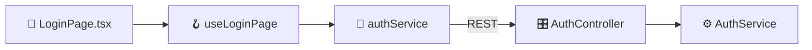

| | 엔드포인트 | 프론트 | 백엔드 |
|---|---|---|---|
| ✅ | `POST /api/v1/auth/login` | `login()` | `AuthController.login` |
| ⚠️ | `GET /api/v1/auth/sso/config` | `getSsoConfigApi()` | **백엔드 매칭 없음** |
| ⚠️ | `POST /api/v1/auth/sso/login` | `ssoLoginApi()` | **백엔드 매칭 없음** |
| 💤 | `POST /api/v1/auth/logout` | — | `AuthController.logout` (프론트 호출 없음) |
| 💤 | `POST /api/v1/auth/refresh` | — | `AuthController.refresh` (프론트 호출 없음) |

### quotation — 견적서 (업로드 / 파싱 / 목록)  ·  🟢 연동

- **프론트** `/parsing_card` · `src/features/parsing/ParsingCardPage.tsx`
- **백엔드** `com.costanalysis.domain.quotation`

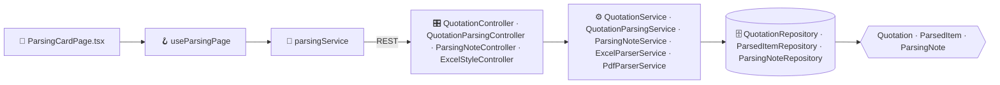

| | 엔드포인트 | 프론트 | 백엔드 |
|---|---|---|---|
| ✅ | `GET /api/v1/quotations` | `fetchQuotationsApi()` | `QuotationController.list` |
| ✅ | `POST /api/v1/quotations/upload` | `uploadFilesApi()` | `QuotationParsingController.upload` |
| 💤 | `GET /api/v1/quotations/mine` | — | `QuotationController.listMine` (프론트 호출 없음) |
| 💤 | `GET /api/v1/quotations/{}` | — | `QuotationController.detail` (프론트 호출 없음) |
| 💤 | `DELETE /api/v1/quotations/{}` | — | `QuotationController.delete` (프론트 호출 없음) |
| 💤 | `PATCH /api/v1/quotations/items/{}` | — | `QuotationController.updateItem` (프론트 호출 없음) |
| 💤 | `GET /api/v1/quotations/{}/parse` | — | `QuotationParsingController.parseStream` (프론트 호출 없음) |
| 💤 | `GET /api/v1/quotations/notes/file/{}` | — | `ParsingNoteController.listByFile` (프론트 호출 없음) |
| 💤 | `POST /api/v1/quotations/notes` | — | `ParsingNoteController.create` (프론트 호출 없음) |
| 💤 | `DELETE /api/v1/quotations/notes/{}` | — | `ParsingNoteController.delete` (프론트 호출 없음) |
| 💤 | `GET /api/v1/quotations/notes/file/{}/count` | — | `ParsingNoteController.countByFile` (프론트 호출 없음) |
| 💤 | `GET /api/v1/excel/styles` | — | `ExcelStyleController.styles` (프론트 호출 없음) |

### dashboard — 대시보드  ·  🟢 연동

- **프론트** `/dashboard` · `src/features/dashboard/DashboardPage.tsx`
- **백엔드** `com.costanalysis.domain.dashboard`

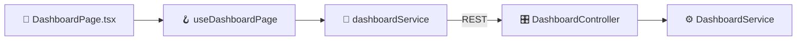

| | 엔드포인트 | 프론트 | 백엔드 |
|---|---|---|---|
| ✅ | `GET /api/v1/dashboard/stats` | `fetchStats()` | `DashboardController.stats` |

### insight — AI 인사이트 (Claude 채팅)  ·  🟢 연동

- **프론트** `/insight` · `src/features/insight/InsightPage.tsx`
- **백엔드** `com.costanalysis.domain.insight`

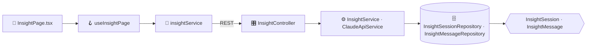

| | 엔드포인트 | 프론트 | 백엔드 |
|---|---|---|---|
| ⚠️ | `GET /api/v1/insights/sessions` | `fetchSessions()` | **백엔드 매칭 없음** |
| ⚠️ | `POST /api/v1/insights/sessions` | `createSession()` | **백엔드 매칭 없음** |
| ⚠️ | `POST /api/v1/insights/sessions/{}/messages` | `sendMessage()` | **백엔드 매칭 없음** |
| 💤 | `POST /api/v1/insight/sessions` | — | `InsightController.createSession` (프론트 호출 없음) |
| 💤 | `GET /api/v1/insight/sessions` | — | `InsightController.listSessions` (프론트 호출 없음) |
| 💤 | `GET /api/v1/insight/sessions/{}/messages` | — | `InsightController.messages` (프론트 호출 없음) |
| 💤 | `DELETE /api/v1/insight/sessions/{}` | — | `InsightController.deleteSession` (프론트 호출 없음) |
| 💤 | `POST /api/v1/insight/sessions/{}/chat` | — | `InsightController.chatStream` (프론트 호출 없음) |
| 💤 | `POST /api/v1/insight/sessions/{}/messages` | — | `InsightController.sendMessage` (프론트 호출 없음) |

### notification — 알림 / 이력  ·  🟢 연동

- **프론트** `/history` · `src/features/history/HistoryPage.tsx`
- **백엔드** `com.costanalysis.domain.notification`

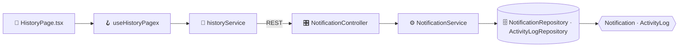

| | 엔드포인트 | 프론트 | 백엔드 |
|---|---|---|---|
| ✅ | `GET /api/v1/notifications` | `fetchNotifications()` | `NotificationController.list` |
| ✅ | `PUT /api/v1/notifications/read-all` | `markAllRead()` | `NotificationController.markAllRead` |
| ⚠️ | `GET /api/v1/notifications/activities` | `fetchActivities()` | **백엔드 매칭 없음** |
| 💤 | `GET /api/v1/notifications/unread-count` | — | `NotificationController.unreadCount` (프론트 호출 없음) |
| 💤 | `PUT /api/v1/notifications/{}/read` | — | `NotificationController.markRead` (프론트 호출 없음) |

### model — 원가 모델 (수식 / 변경요청 워크플로)  ·  🟢 연동

- **프론트** `/models` · `src/features/model-management/ModelManagementPage.tsx`
- **백엔드** `com.costanalysis.domain.model`

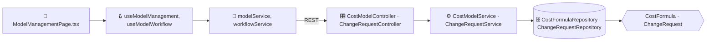

| | 엔드포인트 | 프론트 | 백엔드 |
|---|---|---|---|
| ✅ | `GET /api/v1/models/change-requests` | `fetchChangeRequests()` | `ChangeRequestController.list` |
| ✅ | `POST /api/v1/models/change-requests` | `createChangeRequest()` | `ChangeRequestController.create` |
| ✅ | `PUT /api/v1/models/change-requests/{}/approve` | `approveChangeRequest()` | `ChangeRequestController.approve` |
| ✅ | `PUT /api/v1/models/change-requests/{}/reject` | `rejectChangeRequest()` | `ChangeRequestController.reject` |
| ✅ | `DELETE /api/v1/models/change-requests/{}` | `deleteChangeRequest()` | `ChangeRequestController.delete` |
| ⚠️ | `GET /api/v1/models/formulas` | `fetchFormulas()` | **백엔드 매칭 없음** |
| ⚠️ | `POST /api/v1/models/formulas` | `createFormula()` | **백엔드 매칭 없음** |
| ⚠️ | `PUT /api/v1/models/formulas/{}` | `updateFormula()` | **백엔드 매칭 없음** |
| ⚠️ | `DELETE /api/v1/models/formulas/{}` | `deleteFormula()` | **백엔드 매칭 없음** |
| 💤 | `GET /api/v1/formulas` | — | `CostModelController.list` (프론트 호출 없음) |
| 💤 | `GET /api/v1/formulas/{}` | — | `CostModelController.detail` (프론트 호출 없음) |
| 💤 | `POST /api/v1/formulas` | — | `CostModelController.create` (프론트 호출 없음) |
| 💤 | `PUT /api/v1/formulas/{}` | — | `CostModelController.update` (프론트 호출 없음) |
| 💤 | `DELETE /api/v1/formulas/{}` | — | `CostModelController.delete` (프론트 호출 없음) |
| 💤 | `GET /api/v1/models/change-requests/formula/{}` | — | `ChangeRequestController.byFormula` (프론트 호출 없음) |

### analysis — 원가 분석  ·  🟡 부분연동

- **프론트** `/analysis` · `src/features/analysis/AnalysisPage.tsx`
- **백엔드** `com.costanalysis.domain.analysis`

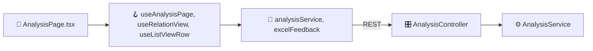

| | 엔드포인트 | 프론트 | 백엔드 |
|---|---|---|---|
| ⚠️ | `GET /api/v1/analysis/{}/feedback-excel` | `downloadFeedbackExcel()` | **백엔드 매칭 없음** |
| 💤 | `GET /api/v1/quotations/{}/analysis` | — | `AnalysisController.getAnalysis` (프론트 호출 없음) |
| 💤 | `GET /api/v1/quotations/{}/analysis/feedback-excel` | — | `AnalysisController.feedbackExcel` (프론트 호출 없음) |

### verification — 데이터 검증  ·  ⚪ mock전용

- **프론트** `/verification` · `src/features/verification/ParsedDataReviewPage.tsx`
- **백엔드** `com.costanalysis.domain.verification`

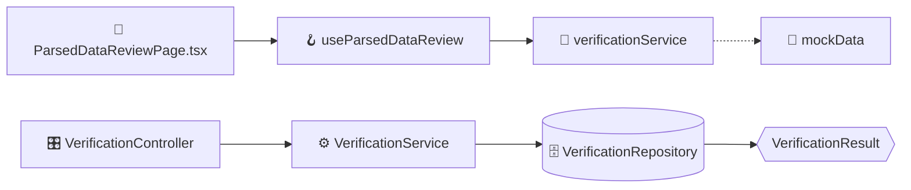

| | 엔드포인트 | 프론트 | 백엔드 |
|---|---|---|---|
| 💤 | `POST /api/v1/quotations/{}/verification` | — | `VerificationController.create` (프론트 호출 없음) |
| 💤 | `GET /api/v1/quotations/{}/verification` | — | `VerificationController.get` (프론트 호출 없음) |
| 💤 | `PUT /api/v1/verifications/{}/decision` | — | `VerificationController.decide` (프론트 호출 없음) |

### comparison — 견적서 비교  ·  ⚪ mock전용

- **프론트** `/comparison` · `src/features/comparison/QuotationComparisonPage.tsx`
- **백엔드** `com.costanalysis.domain.comparison`

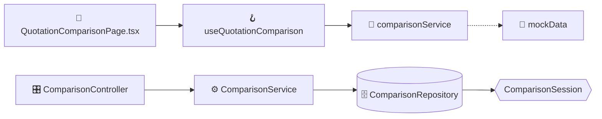

| | 엔드포인트 | 프론트 | 백엔드 |
|---|---|---|---|
| 💤 | `POST /api/v1/comparisons` | — | `ComparisonController.create` (프론트 호출 없음) |
| 💤 | `GET /api/v1/comparisons` | — | `ComparisonController.list` (프론트 호출 없음) |
| 💤 | `GET /api/v1/comparisons/{}` | — | `ComparisonController.detail` (프론트 호출 없음) |
| 💤 | `DELETE /api/v1/comparisons/{}` | — | `ComparisonController.delete` (프론트 호출 없음) |

### user — 사용자 / 설정  ·  ⚪ mock전용

- **프론트** `/settings` · `src/features/settings/SettingsPage.tsx`
- **백엔드** `com.costanalysis.domain.user`

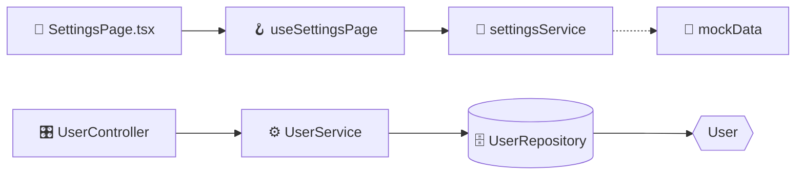

| | 엔드포인트 | 프론트 | 백엔드 |
|---|---|---|---|
| 💤 | `GET /api/v1/users/me` | — | `UserController.me` (프론트 호출 없음) |
| 💤 | `PUT /api/v1/users/me` | — | `UserController.updateMe` (프론트 호출 없음) |
| 💤 | `PUT /api/v1/users/me/password` | — | `UserController.changePassword` (프론트 호출 없음) |
| 💤 | `GET /api/v1/users` | — | `UserController.list` (프론트 호출 없음) |
| 💤 | `POST /api/v1/users` | — | `UserController.create` (프론트 호출 없음) |
| 💤 | `PUT /api/v1/users/{}/active` | — | `UserController.setActive` (프론트 호출 없음) |

### system — 시스템 관리 (메뉴 / 권한 / 사원 / 조직) — RBAC  ·  ⚪ mock전용

- **프론트** `/system/menus` · `src/features/system/MenuManagementPage.tsx`
- **백엔드** `com.costanalysis.domain.system`

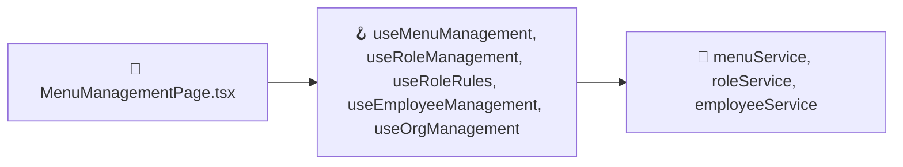

| | 엔드포인트 | 프론트 | 백엔드 |
|---|---|---|---|
| ⚠️ | `GET /api/v1/menus/my` | `fetchMyPermissionsApi()` | **백엔드 매칭 없음** |
| ⚠️ | `GET /api/v1/menus` | `fetchMenusApi()` | **백엔드 매칭 없음** |
| ⚠️ | `PUT /api/v1/menus/{}` | `updateMenuApi()` | **백엔드 매칭 없음** |
| ⚠️ | `GET /api/v1/roles` | `getRoles()` | **백엔드 매칭 없음** |
| ⚠️ | `POST /api/v1/roles` | `createRole()` | **백엔드 매칭 없음** |
| ⚠️ | `PUT /api/v1/roles/{}` | `updateRole()` | **백엔드 매칭 없음** |
| ⚠️ | `DELETE /api/v1/roles/{}` | `deleteRole()` | **백엔드 매칭 없음** |
| ⚠️ | `POST /api/v1/roles/{}/copy` | `copyRole()` | **백엔드 매칭 없음** |
| ⚠️ | `GET /api/v1/roles/{}/permissions` | `getRolePermissionMatrix()` | **백엔드 매칭 없음** |
| ⚠️ | `PUT /api/v1/roles/{}/permissions` | `saveRolePermissionMatrix()` | **백엔드 매칭 없음** |
| ⚠️ | `GET /api/v1/role-rules` | `getRoleRules()` | **백엔드 매칭 없음** |
| ⚠️ | `POST /api/v1/role-rules` | `createRoleRule()` | **백엔드 매칭 없음** |
| ⚠️ | `PUT /api/v1/role-rules/{}` | `updateRoleRule()` | **백엔드 매칭 없음** |
| ⚠️ | `DELETE /api/v1/role-rules/{}` | `deleteRoleRule()` | **백엔드 매칭 없음** |
| ⚠️ | `POST /api/v1/role-rules/simulate` | `simulateRoleRule()` | **백엔드 매칭 없음** |
| ⚠️ | `POST /api/v1/role-rules/reapply` | `reapplyRoleRules()` | **백엔드 매칭 없음** |
| ⚠️ | `GET /api/v1/employees` | `getEmployees()` | **백엔드 매칭 없음** |
| ⚠️ | `GET /api/v1/employees/{}` | `getEmployee()` | **백엔드 매칭 없음** |
| ⚠️ | `POST /api/v1/employees` | `createEmployee()` | **백엔드 매칭 없음** |
| ⚠️ | `PUT /api/v1/employees/{}` | `updateEmployee()` | **백엔드 매칭 없음** |
| ⚠️ | `PUT /api/v1/employees/{}/roles` | `changeEmployeeRole()` | **백엔드 매칭 없음** |
| ⚠️ | `PUT /api/v1/employees/roles/bulk` | `bulkChangeRole()` | **백엔드 매칭 없음** |
| ⚠️ | `PUT /api/v1/employees/{}/status` | `setEmployeeStatus()` | **백엔드 매칭 없음** |
| ⚠️ | `POST /api/v1/employees/{}/reapply-rule` | `reapplyRuleForEmployee()` | **백엔드 매칭 없음** |
| ⚠️ | `GET /api/v1/departments` | `getDepartments()` | **백엔드 매칭 없음** |
| ⚠️ | `POST /api/v1/departments` | `createDepartment()` | **백엔드 매칭 없음** |
| ⚠️ | `PUT /api/v1/departments/{}` | `updateDepartment()` | **백엔드 매칭 없음** |
| ⚠️ | `DELETE /api/v1/departments/{}` | `deleteDepartment()` | **백엔드 매칭 없음** |
| ⚠️ | `GET /api/v1/positions` | `getPositions()` | **백엔드 매칭 없음** |
| ⚠️ | `POST /api/v1/positions` | `createPosition()` | **백엔드 매칭 없음** |
| ⚠️ | `PUT /api/v1/positions/{}` | `updatePosition()` | **백엔드 매칭 없음** |
| ⚠️ | `DELETE /api/v1/positions/{}` | `deletePosition()` | **백엔드 매칭 없음** |

